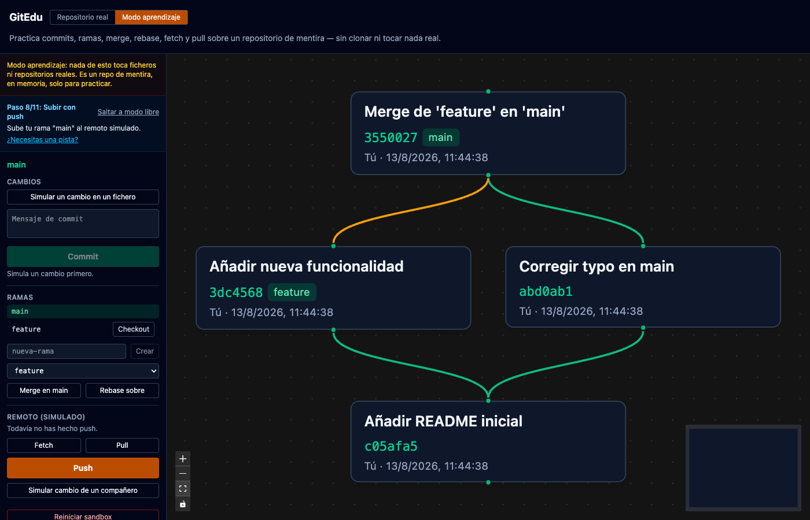
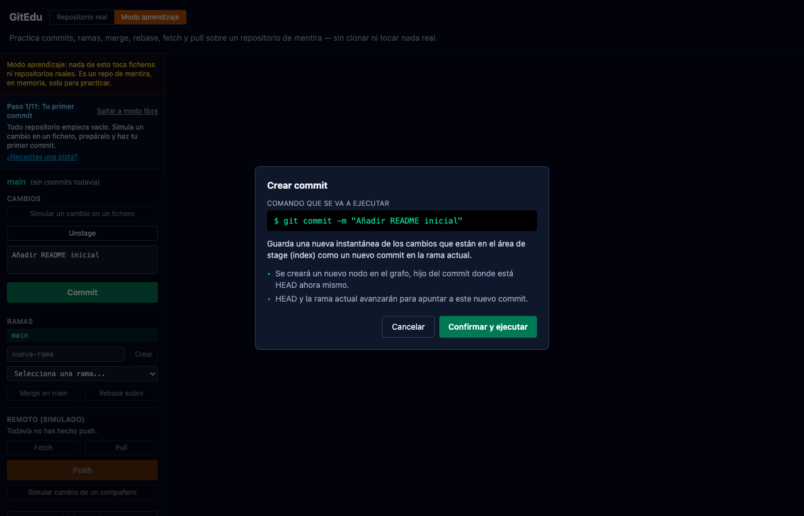
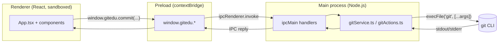

# GitEdu

A desktop app that visualizes local Git repositories as an interactive commit graph — and, unlike most Git GUIs, shows you the **exact command it's about to run and its impact on the branch tree** before it runs it. Built to help people actually understand Git, not just click buttons.

> 🚧 Personal / educational project, not a production tool. Built end-to-end in a focused session as a way to explore Electron's process model and Git internals in depth.

<!--
  Drop your own screenshots here (see "Capturing screenshots" below) and
  uncomment these lines. Recommended shots, in this order:
    1. docs/screenshots/graph.png            – full window, a repo with a merge loaded
    2. docs/screenshots/command-preview.png  – the confirmation modal before a merge/rebase
    3. docs/screenshots/interactive-rebase.png – the interactive rebase editor
    4. docs/screenshots/conflict.png         – the conflict resolution panel

  
  
-->

## Why

Most Git GUIs optimize for speed: click, and it's done. That's great once you already know Git, but it teaches you nothing about what actually happened. GitEdu inverts that: every state-changing action (`commit`, `merge`, `rebase`, `push`) stops first at a preview panel showing the literal command, a plain-language explanation of what it does, and what it will do to the graph — then you confirm.

## Features

- **Commit graph visualization** — [React Flow](https://reactflow.dev/) + [dagre](https://github.com/dagrejs/dagre) for layout, reading `git log --all` in a structured (not just text) format.
- **Command preview panel** — before `commit`, `merge`, `rebase` or `push`, see the exact command and its expected effect on the tree; merge/rebase also highlight the two branch tips involved directly on the graph.
- **Full write flow** — stage/unstage, commit, create/checkout branches, merge, rebase, push, all via native `git`.
- **Interactive rebase** — pick / reword / squash / drop commits and reorder them, executed as a single scripted, non-interactive `git rebase -i` (details below).
- **Conflict resolution panel** — detects an in-progress merge or rebase, lists conflicted files, and lets you resolve via "ours" / "theirs" or mark as resolved after a manual edit, then continue or abort.
- **Native folder picker**, packaged as a real desktop app via `electron-builder`.

## The interesting bit: scripting `git rebase -i` with no terminal

`git rebase -i` normally opens `$EDITOR` for you to hand-write a `pick`/`squash`/`drop` sequence, and pauses again on every `reword`/`squash` to edit commit messages. None of that works in a GUI with no TTY.

GitEdu's [`gitActions.ts`](electron/services/gitActions.ts) builds the desired sequence itself and injects it with a well-known trick: set `GIT_SEQUENCE_EDITOR` to a `cp` command that copies our pre-written todo file over the one Git is about to open. Rewording is handled by inserting an `exec git commit --amend -F <message-file>` line right after the `pick` — using `-F` (read from file) rather than `-m` means a rewritten commit message can never break out into a shell command, however many quotes or `;` it contains. `squash` uses `fixup` under the hood specifically to avoid a second editor pause for combining messages.

The one thing that *can* still legitimately pause a scripted rebase is a real content conflict — which is exactly what the conflict resolution panel is for. The whole thing was verified against disposable throwaway repos, including a rebase that pauses mid-sequence on a conflict, gets resolved, and resumes correctly.

## Architecture

Standard Electron three-process split, communicating only through a typed IPC contract — the renderer never touches `child_process` directly.



Every git invocation goes through `execFile` with an argument array — never a shell string — so user input (branch names, commit messages) can't break out into shell injection. See [`shared/ipc-contract.ts`](shared/ipc-contract.ts) for the full typed contract between processes.

## Tech stack

Electron · TypeScript · React · Tailwind CSS v4 · React Flow · dagre · electron-vite · electron-builder

## Getting started

```bash
npm install
npm run dev       # launches the app with hot reload
```

```bash
npm run build      # type-check + production bundle
npm run package    # unpacked app in release/ (fast, for local testing)
npm run dist        # full installer for your platform
```

## Capturing screenshots

```bash
npm run dev
```

Open any local repo (ideally one with a branch and a merge, so the graph has something to show), then capture:

1. The main window with the graph loaded.
2. The command preview modal — trigger it from a merge or rebase button.
3. The interactive rebase panel — "Rebase interactivo sobre..." in the branch panel.
4. The conflict panel — easiest to trigger by merging two branches that touch the same line of the same file.

Save them into `docs/screenshots/` and uncomment the image block at the top of this file.

## Known limitations

Being upfront about scope, since this was built to learn and to show real, working code rather than to cover every edge case:

- No inline 3-way diff/merge editor — conflicts are resolved via "ours"/"theirs" or by editing the file externally and marking it resolved.
- Interactive rebase covers pick/reword/squash/drop/reorder, not the full range of `git rebase -i` (no `edit` pauses, no `exec` steps beyond the internal reword mechanism).
- No code signing configured for the packaged app — `npm run dist` produces an unsigned build.

## License

MIT — see [LICENSE](LICENSE).
