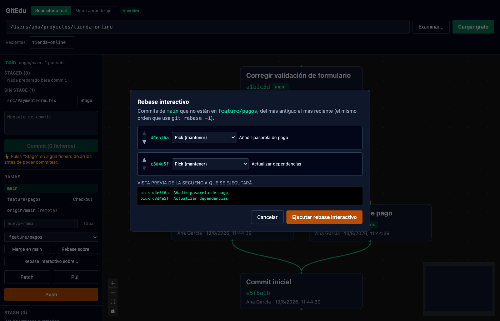
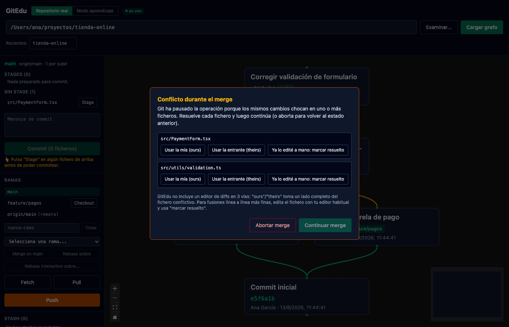
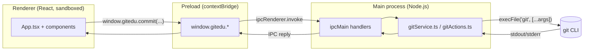

<div align="center">

# GitEdu

**Learn Git by seeing it happen.** A desktop app that visualizes your local repositories as an interactive commit graph — and, unlike most Git GUIs, shows you the **exact command it's about to run and its effect on the branch tree** before it runs it.

[](https://github.com/Hermida95/gitedu/releases/latest)
[](https://github.com/Hermida95/gitedu/actions/workflows/ci.yml)
[](LICENSE)


**[⬇ Download the latest release](https://github.com/Hermida95/gitedu/releases/latest)** · [Guía de uso en español](docs/GUIA-DE-USO.md) · [Security](SECURITY.md)

</div>

> 🚧 Personal / educational project, not a production tool. Built end-to-end in a focused series of sessions to explore Electron's process model and Git internals in depth — and to have something real to point at.


<table>
<tr>
<td width="50%"></td>
<td width="50%"></td>
</tr>
<tr>
<td width="50%"></td>
<td width="50%" valign="middle" align="center"><em>Screenshots captured from the sandbox / a mocked session — no real repository was touched.</em></td>
</tr>
</table>

---

## Table of contents

- [Why](#why)
- [Features](#features)
- [Download](#download)
- [Running from source](#running-from-source)
- [How to use it](#how-to-use-it)
- [Architecture](#architecture)
- [The interesting bit: scripting `git rebase -i` with no terminal](#the-interesting-bit-scripting-git-rebase--i-with-no-terminal)
- [Tech stack](#tech-stack)
- [Known limitations](#known-limitations)
- [Security](#security)
- [License](#license)

## Why

Most Git GUIs optimize for speed: click, and it's done. That's great once you already know Git, but it teaches you nothing about what actually happened. GitEdu inverts that priority — every state-changing action (`commit`, `merge`, `rebase`, `push`...) stops first at a preview panel showing the literal command, a plain-language explanation of what it does, and what it will change on the graph. Only then do you confirm.

The same philosophy drives the built-in **learning mode**: a fully sandboxed, in-memory fake repository where you can click through commits, branches, merges and rebases with zero risk to any real project, guided by an 11-step lesson track.

## Features

| | |
|---|---|
| 🗺️ **Commit graph visualization** | [React Flow](https://reactflow.dev/) + [dagre](https://github.com/dagrejs/dagre) layout, reading `git log --all` into a structured (not just text) format. |
| 💬 **Command preview panel** | Before `commit`, `merge`, `rebase`, `push`, `pull`, `fetch`, checkout, branch creation, or touching a stash: the exact command, its expected effect, and which branches it touches — highlighted live on the graph. |
| ✍️ **Full write flow** | Stage/unstage, commit, create/checkout branches, merge, rebase, stash (save/pop/drop), fetch, pull, push — all through your real, local `git`. |
| 🔀 **Interactive rebase** | Pick / reword / squash / drop commits and reorder them, executed as a single scripted, non-interactive `git rebase -i` — see [how](#the-interesting-bit-scripting-git-rebase--i-with-no-terminal). |
| ⚠️ **Conflict resolution panel** | Detects an in-progress merge or rebase, lists conflicted files, and lets you resolve via "ours" / "theirs" or mark as resolved after a manual edit, then continue or abort. |
| 📄 **Diff viewer** | Click any file in the status list for its unified diff — staged, unstaged, or the full content of a new untracked file. |
| 🔴 **Live refresh** | Watches the repo's `.git` directory. Run a git command from a terminal (or another tool) while GitEdu has that repo open, and it notices and reloads on its own — a small "en vivo" badge shows when this is active. |
| 🎓 **Sandbox / learning mode** | A "Modo aprendizaje" toggle switches to a fake repository that lives entirely in memory — no clone, no folder, no filesystem access at all. Same graph, same command-preview modal, backed by a pure in-memory git model ([`gitSimulator.ts`](src/lib/gitSimulator.ts)), with a guided 11-step lesson track for people who've never touched git. |
| 🌐 **Open a repo by URL** | Paste a `https://github.com/...` (or `git@...`) link and it clones into `~/GitEdu-Repos/` and loads it. GitEdu only ever reads/writes local repos — there's no "remote mode". |
| 🆕 **Initialize a fresh repo** | Point GitEdu at a plain folder that isn't a git repo yet, and it offers to run `git init` right there instead of just failing. |
| 🕘 **Recent repos** | The last 8 repos you opened, one click away — persisted locally, never sent anywhere. |

## Download

Grab a ready-to-run build from **[the latest release](https://github.com/Hermida95/gitedu/releases/latest)** — no Node, no build step, no terminal:

| Platform | File | Notes |
|---|---|---|
| 🍎 macOS (Apple Silicon) | `GitEdu-<version>-arm64.dmg` | Unsigned — **read the note right below before opening it.** |
| 🪟 Windows | `GitEdu-Setup-<version>.exe` | NSIS installer. |
| 🐧 Linux | `GitEdu-<version>.AppImage` | `chmod +x` it, then run directly. |

> ⚠️ **On macOS, opening the `.dmg` for the first time will say "GitEdu is damaged and can't be opened. You should move it to the Trash."** This is **not true** — the app isn't damaged, it's just unsigned (proper code signing needs a paid $99/year Apple Developer account, which this personal project doesn't have). macOS's Gatekeeper shows this exact "damaged" message — not the usual "unidentified developer" one — specifically for unsigned Apple Silicon builds. **Don't delete it.** After dragging `GitEdu.app` to `/Applications`, open Terminal and run:
>
> ```bash
> xattr -cr /Applications/GitEdu.app
> ```
>
> Then open it normally. This removes the quarantine flag macOS puts on anything downloaded from the internet — it's a one-time step, and it's exactly what you'd expect from any indie/open-source app without a paid certificate.

**No GitHub login, ever.** GitEdu has no OAuth flow and stores no tokens — every clone/fetch/pull/push shells out to your system's `git`, so authentication is whatever you already have configured on that machine (SSH key, macOS Keychain, `gh auth login`, a Windows credential manager...).

## Running from source

You'll need [Node.js](https://nodejs.org/) 20+ and `git` on your `PATH`.

```bash
git clone https://github.com/Hermida95/gitedu.git
cd gitedu
npm install
npm run dev
```

A real Electron window opens with hot reload — this is what you want if you're reading the code alongside using it, or contributing.

To build your own standalone installer instead of downloading one:

```bash
npm run dist
```

Produces `.dmg`/`.app` (macOS), `.exe`/NSIS installer (Windows), or `.AppImage` (Linux) in `release/`, depending on the OS you run it on. `npm run package` does the same build but skips zipping/installer creation — faster, useful for testing packaging locally.

## How to use it

1. **Open a repository** — type a local path, browse for a folder, or paste a GitHub URL to clone it automatically into `~/GitEdu-Repos/`.
2. **Read the graph** — each box is a commit (hash, message, author, date); green tags are branches; lines show parentage. Scroll/zoom with the mouse.
3. **Stage & commit** — click a file to see its diff, "Stage" it, write a message, hit "Commit". The confirmation panel shows the exact `git commit -m "..."` before it runs.
4. **Branch, merge, rebase** — every action that changes history goes through the same preview-then-confirm flow. Merges and rebases highlight both branch tips on the graph.
5. **Fetch / pull / push** — see the difference between "look at what changed remotely" (fetch) and "bring it into my branch" (pull) play out live.
6. **Hit a conflict?** — GitEdu detects it automatically and opens a resolution panel: keep "ours", take "theirs", or mark resolved after editing the file yourself.
7. **New to git entirely?** — flip to **Modo aprendizaje** and follow the 11-step guided sandbox. Nothing there touches a real file or repo.

For a slower, plain-language walkthrough (in Spanish), see the **[full usage guide](docs/GUIA-DE-USO.md)** — it also answers the questions people ask most: *does this work alongside VS Code?*, *does clicking things push to GitHub?*, *what happens to my credentials?*

## Architecture

Standard Electron three-process split, communicating only through a typed IPC contract — the renderer never touches `child_process` directly.



Every git invocation goes through `execFile` with an argument array — never a shell string — so user input (branch names, commit messages) can't break out into shell injection. See [`shared/ipc-contract.ts`](shared/ipc-contract.ts) for the full typed contract between processes.

## The interesting bit: scripting `git rebase -i` with no terminal

`git rebase -i` normally opens `$EDITOR` for you to hand-write a `pick`/`squash`/`drop` sequence, and pauses again on every `reword`/`squash` to edit commit messages. None of that works in a GUI with no TTY.

GitEdu's [`gitActions.ts`](electron/services/gitActions.ts) builds the desired sequence itself and injects it with a well-known trick: set `GIT_SEQUENCE_EDITOR` to a `cp` command that copies a pre-written todo file over the one Git is about to open. Rewording is handled by inserting an `exec git commit --amend -F <message-file>` line right after the `pick` — using `-F` (read from file) rather than `-m` means a rewritten commit message can never break out into a shell command, however many quotes or `;` it contains. `squash` uses `fixup` under the hood specifically to avoid a second editor pause for combining messages.

The one thing that *can* still legitimately pause a scripted rebase is a real content conflict — which is exactly what the conflict resolution panel is for. This was verified against disposable throwaway repos, including a rebase that pauses mid-sequence on a conflict, gets resolved, and resumes correctly.

## Tech stack

Electron · TypeScript · React · Tailwind CSS v4 · React Flow · dagre · electron-vite · electron-builder · Vitest

## Known limitations

Being upfront about scope, since this was built to learn and to show real, working code rather than to cover every edge case:

- The diff viewer shows the unified diff as text — no side-by-side view, no 3-way merge editor. Conflicts are resolved via "ours"/"theirs" or by editing the file externally and marking it resolved.
- Interactive rebase covers pick/reword/squash/drop/reorder, not the full range of `git rebase -i` (no `edit` pauses, no arbitrary `exec` steps).
- No code signing configured for the packaged app — every build is unsigned.
- No tags UI, no remote management (adding/removing remotes) — `origin` is set automatically when you clone by URL.
- The live watcher (`fs.watch` with `recursive: true`) only works natively on macOS and Windows; on Linux it silently falls back to manual refresh.

## Security

See [SECURITY.md](SECURITY.md) for the full threat model and audit history, including two real issues that were found and fixed (a path-traversal bug and a shell-injection edge case) plus a second pass covering the sandbox mode, the recent-repos list, and GitHub Actions supply-chain hardening.

## License

MIT — see [LICENSE](LICENSE).
